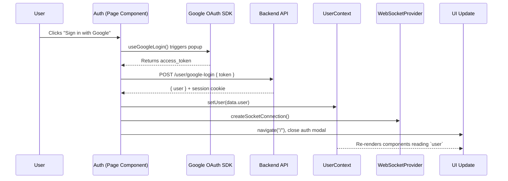
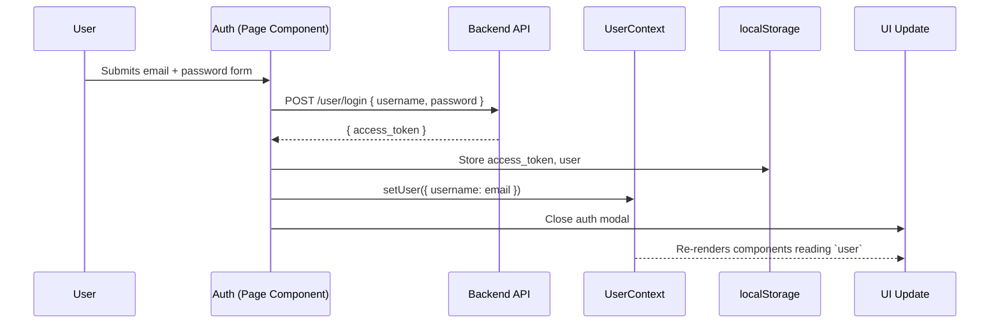
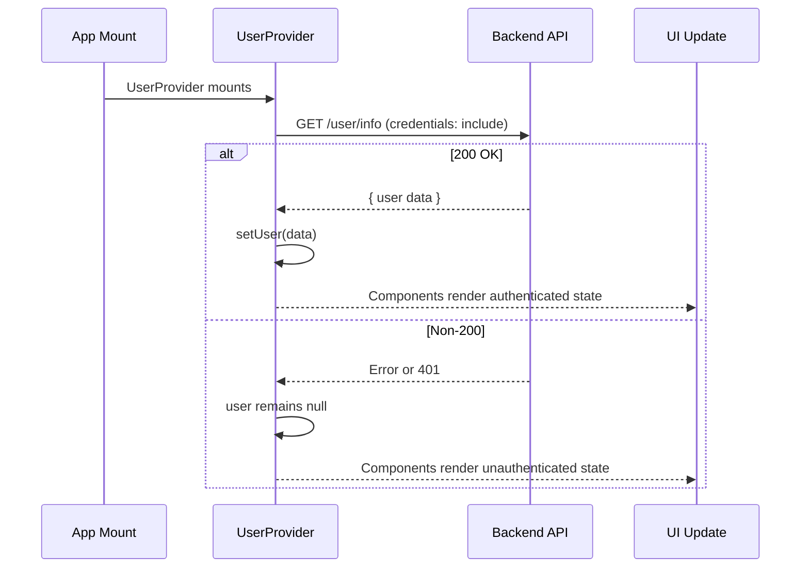
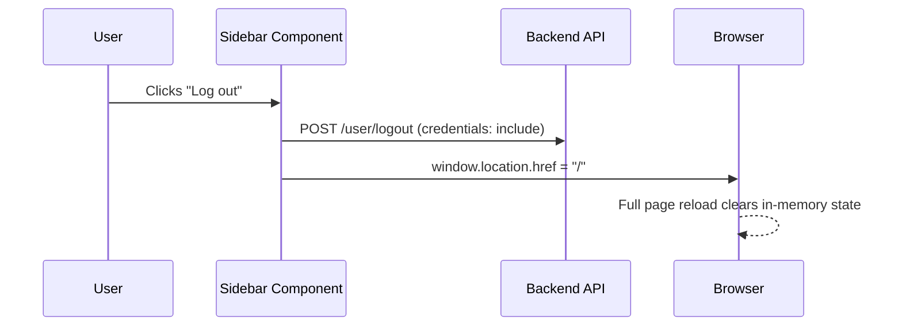
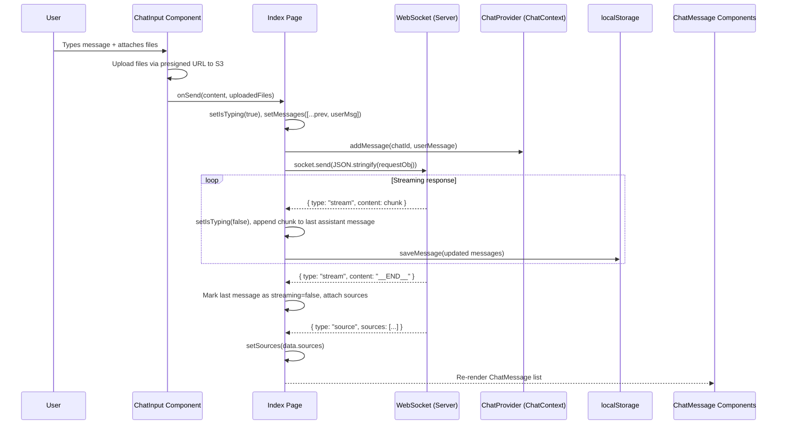
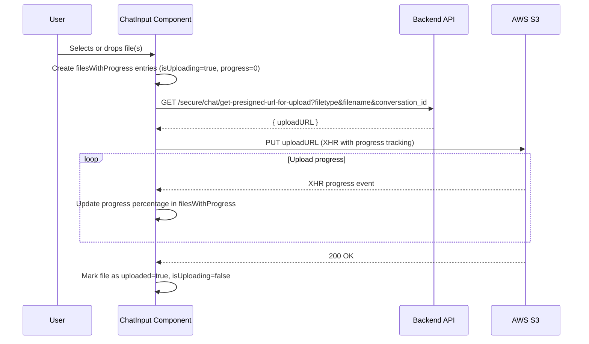

# TaxSurfer — Frontend State & Context Documentation

---

## 1. Document Purpose & Scope

### Purpose

This document provides a factual, descriptive reference of how state is managed across the TaxSurfer frontend application. It is intended for internal engineering review and presentation.

### What Is Documented

- All React Context providers and their owned state
- The provider nesting hierarchy as defined in `App.jsx`
- State flow through contexts, local component state, and external interactions (APIs, `localStorage`, WebSocket)
- Action-to-state-transition mappings
- Observed error and loading state patterns

### What Is Intentionally Out of Scope

- Backend implementation details (FastAPI, Redis, LangGraph, etc.)
- Styling or UI component library internals (shadcn/ui, Tailwind CSS)
- Build tooling configuration (Vite, ESLint, PostCSS)
- Performance analysis, scalability concerns, or refactoring advice
- Security audit of authentication flows

---

## 2. Overview of State Management

The TaxSurfer frontend uses **React Context API** as its primary mechanism for sharing state across the component tree. There is no external state management library (e.g., Redux, Zustand, Jotai) in use.

Additionally, **TanStack React Query** (`@tanstack/react-query`) is installed and its `QueryClientProvider` wraps the application, but observed usage of React Query hooks within pages and components is **not present** in the current codebase. The `QueryClient` is instantiated in `App.jsx` but no `useQuery` or `useMutation` calls were found in the reviewed files.

### Provider Nesting Order (as defined in `App.jsx`)

```
GoogleOAuthProvider
  └── QueryClientProvider
        └── ThemeProvider (next-themes)
              └── UserProvider (UserContext)
                    └── TooltipProvider
                          └── WebSocketProvider
                                └── ChatProvider
                                      └── BrowserRouter
                                            └── AppRoutes
```

`MainLayout` (rendered by the router) provides its own `LayoutContext.Provider` wrapping the outlet and child components.

### Local State vs. Context-Managed State

- **Context-managed state**: User identity, WebSocket connection, chat message store by thread, theme, and layout panel visibility (source sidebar, auth modal).
- **Local component state**: Form inputs, per-page UI toggles, file upload progress, scroll position, typing indicators, calendar events, pagination, and search queries.

---

## 3. Context Responsibility Matrix

| Context Name                                      | Owned State                                                                      | Exposed Actions                                              | Consuming Components / Pages                                                                                 | External Interactions                                                        |
| ------------------------------------------------- | -------------------------------------------------------------------------------- | ------------------------------------------------------------ | ------------------------------------------------------------------------------------------------------------ | ---------------------------------------------------------------------------- |
| **`UserContext`** (`UserProvider`)                | `user` (object or `null`)                                                        | `setUser`                                                    | `Index`, `Auth`, `Header`, `Sidebar`, `UserDropdown`                                                         | Fetches `GET /user/info` on mount (with cookies)                             |
| **`WebSocketContext`** (`WebSocketProvider`)      | `socketRef` (WebSocket ref), `isConnected` (boolean)                             | `sendMessage(msg)`, `createSocketConnection()`               | `Index`, `Auth`                                                                                              | Opens WebSocket to `/secure/chat/ws` on mount                                |
| **`ChatContext`** (`ChatProvider`)                | `messagesByThread` (object keyed by thread ID)                                   | `addMessage(threadId, message)`, `clearChat(threadId)`       | `Index`                                                                                                      | None (in-memory only)                                                        |
| **`LayoutContext`** (provided by `MainLayout`)    | `isSourceOpen` (boolean), `sources` (array or `null`), `authModalOpen` (boolean) | `openSourceWithData(data)`, `openAuthModal()`                | `Index`, `ChatMessage`, `Header`                                                                             | None                                                                         |
| **`ThemeProvider`** (next-themes)                 | `theme` (string)                                                                 | `setTheme(theme)`                                            | `ThemeToggle`                                                                                                | Persists to `localStorage` (handled by `next-themes` internally)             |
| **`GoogleOAuthProvider`** (@react-oauth/google)   | OAuth client configuration                                                       | `useGoogleLogin()` hook                                      | `Auth`                                                                                                       | Communicates with Google Identity Services                                   |
| **`QueryClientProvider`** (@tanstack/react-query) | Query cache                                                                      | TODO: No observed React Query hook usage in current codebase | TODO                                                                                                         | TODO                                                                         |
| **`AuthContext`** (`AuthProvider`)                | `user`, `loading`                                                                | `signInWithGoogle()`, `signOut()`, `refreshMe()`             | **Not mounted in `App.jsx`** — exists in `auth/AuthProvider.jsx` but is not part of the active provider tree | Fetches `GET /api/auth/me`, `POST /api/auth/google`, `POST /api/auth/logout` |

> **Note:** `AuthProvider` (`auth/AuthProvider.jsx`) defines a full auth context but is **not rendered** in the current `App.jsx` provider tree. Authentication is handled instead by `UserContext` + the `Auth` page component's direct API calls.

---

## 4. Frontend State Flow Diagrams

### 4.1 Authentication-Related State Flow

#### 4.1.1 Google OAuth Login (Active Implementation)



#### 4.1.2 Email/Password Login



#### 4.1.3 User Session Check on App Mount



#### 4.1.4 Logout



### 4.2 Generic Data-Fetching State Flow (Chat / WebSocket Message Flow)



### 4.3 File Upload State Flow



---

## 5. State Ownership Rules (Descriptive Only)

### What Is Handled as Local Component State

| State Category          | Location               | Examples                                                                                                                                                                                         |
| ----------------------- | ---------------------- | ------------------------------------------------------------------------------------------------------------------------------------------------------------------------------------------------ |
| Form inputs             | Page / component level | `email`, `password` (Auth), `message` (ChatInput), `searchQuery` (CallSummary, History), `newEvent` (Calendar)                                                                                   |
| UI toggle flags         | Page / component level | `isSidebarOpen` (MainLayout, Calendar), `isExpanded` (ChatHistoryDropdown), `showScrollButton` (Index), `isDragging` (ChatInput), `showError` (Auth)                                             |
| Per-page data           | Page level             | `messages`, `sources`, `currentChatId`, `isTyping`, `isFileUploaded` (Index); `events`, `googleCalendarEvents`, `outlookCalendarEvents` (Calendar); `selectedCalls`, `currentPage` (CallSummary) |
| File upload tracking    | Component level        | `filesWithProgress` array in ChatInput                                                                                                                                                           |
| Derived/computed values | Component level        | `allEvents` (Calendar), `filtered` and `pageItems` (CallSummary), `filteredHistory` (History)                                                                                                    |

### What Is Handled by Context

| State Category                                          | Context                       | Scope                                |
| ------------------------------------------------------- | ----------------------------- | ------------------------------------ |
| Authenticated user identity                             | `UserContext`                 | App-wide                             |
| WebSocket connection + readiness                        | `WebSocketContext`            | App-wide                             |
| Chat messages indexed by thread                         | `ChatContext`                 | App-wide                             |
| Theme (dark/light)                                      | `ThemeProvider` (next-themes) | App-wide                             |
| Source sidebar visibility + data, auth modal visibility | `LayoutContext`               | Within `MainLayout` and its children |

### Typical Ownership Boundaries

- State that is consumed by more than one component subtree is placed in a context provider.
- State that is specific to a single page or a parent-child relationship is kept as local `useState`.
- `localStorage` is used as a persistence layer for chat history (`chatList`, `chatHistory`), access tokens (`access_token`), user objects, and calendar provider tokens. It is read during component mount via `useEffect` and written during state transitions.

---

## 6. Action → State Transition Table

| Action                         | Trigger Source                      | Context Involved                    | State Change                                                                                  | UI Affected                                                 |
| ------------------------------ | ----------------------------------- | ----------------------------------- | --------------------------------------------------------------------------------------------- | ----------------------------------------------------------- |
| App mounts                     | `UserProvider` `useEffect`          | `UserContext`                       | `user` set from `/user/info` response or remains `null`                                       | Header, Sidebar show/hide user-dependent elements           |
| App mounts                     | `WebSocketProvider` `useEffect`     | `WebSocketContext`                  | WebSocket created, `isConnected` → `true` on open                                             | None directly; enables chat messaging                       |
| Google login success           | Auth page `handleGoogleLogin`       | `UserContext`, `WebSocketContext`   | `user` set to response user object; new WebSocket connection created                          | Auth modal closes, navigate to `/`                          |
| Email/password login success   | Auth page `handleLogin`             | `UserContext`                       | `user` set to `{ username: email }`                                                           | Auth modal closes                                           |
| Login failure (email/password) | Auth page `handleLogin`             | None                                | `showError` → `true` (local)                                                                  | Error message displayed in auth form                        |
| Logout                         | Sidebar `handleLogout`              | None (page reloads)                 | Server session cleared; `window.location.href = "/"` triggers full reload                     | Entire app resets                                           |
| Send chat message              | Index page `handleSendMessage`      | `ChatContext`, `WebSocketContext`   | `messages` appended with user message; `isTyping` → `true`; message added to `ChatContext`    | New user message bubble appears; typing indicator shown     |
| Receive streamed chunk         | WebSocket `onmessage`               | None (local state in Index)         | Chunk appended to last assistant message content; `isTyping` → `false`                        | Assistant message bubble grows incrementally                |
| Receive `__END__` marker       | WebSocket `onmessage`               | None (local state in Index)         | Last message `streaming` → `false`; sources attached                                          | Streaming indicator removed; source button appears          |
| Receive source data            | WebSocket `onmessage`               | None (local state in Index)         | `sources` state updated                                                                       | Available for sidebar display                               |
| Open source sidebar            | `ChatMessage` click                 | `LayoutContext`                     | `isSourceOpen` toggled; `sources` set                                                         | ChatHistory sidebar opens with PDF list                     |
| Open auth modal                | Header / Index page                 | `LayoutContext`                     | `authModalOpen` → `true`                                                                      | Auth dialog renders                                         |
| File attached                  | ChatInput drag/drop or file picker  | None (local)                        | `filesWithProgress` array grows; per-file `progress`, `isUploading` tracked                   | FileChip components render with progress bars               |
| File upload complete           | ChatInput XHR callback              | None (local)                        | File entry `uploaded` → `true`, `isUploading` → `false`                                       | Upload progress indicator completes                         |
| Navigate to existing chat      | ChatHistoryDropdown click           | None                                | Route changes to `/:encryptedId`; `currentChatId` and `messages` restored from `localStorage` | Previous chat messages render                               |
| Delete chat from history       | ChatHistoryDropdown delete button   | None                                | Chat removed from local `chatHistory` state and `localStorage`                                | Chat entry removed from sidebar list                        |
| Toggle theme                   | ThemeToggle button                  | ThemeProvider (next-themes)         | `theme` toggles between `"dark"` and `"light"`                                                | Entire app re-renders with new theme class                  |
| Toggle sidebar                 | Header menu button / Sidebar toggle | None (MainLayout local)             | `isSidebarOpen` toggled                                                                       | Sidebar expands or collapses                                |
| Google Calendar sign-in        | Calendar page button                | None (local)                        | `isGoogleSignedIn` → `true`; `googleAccessToken` set; `googleCalendarEvents` populated        | Calendar renders Google events; button changes to "Refresh" |
| Outlook Calendar connect       | Calendar page button                | None (local)                        | Browser redirects to Microsoft OAuth URL                                                      | Page navigates away for OAuth                               |
| Add calendar event             | Calendar page form submit           | None (local)                        | Event added to Google Calendar via API or appended to `events` (local)                        | Calendar view updates with new event                        |
| WebSocket disconnect           | WebSocket `onclose`                 | `WebSocketContext` (local in Index) | `isConnected` → `false`; `isTyping` → `false`; system message appended                        | Typing indicator removed; system error message shown        |
| Page/tab unload                | `beforeunload` event                | None                                | Current chat messages persisted to `localStorage` via `addChatToList`                         | None (browser is closing)                                   |

---

## 7. Error & Loading States (Observational)

### Loading States

| Scenario                                     | Representation                                                                                                                                                                      |
| -------------------------------------------- | ----------------------------------------------------------------------------------------------------------------------------------------------------------------------------------- |
| User session check on mount (`UserProvider`) | No explicit loading indicator observed. `user` is `null` until the fetch resolves. Components conditionally render based on `user` being truthy or `null`.                          |
| Chat message streaming                       | A `TypingIndicator` component renders (animated dots) when `isTyping` is `true`. It disappears when the first stream chunk arrives.                                                 |
| File upload                                  | Each file displays a `FileChip` component with a progress bar. `isUploading` flag controls the progress indicator. A text label shows "uploading..." while any file is in progress. |
| Auth form submission                         | The submit button text changes from `"Sign In"` to `"Loading..."` and the button becomes `disabled` while `loading` is `true`.                                                      |
| PDF modal loading                            | The `PdfModalViewer` fetches a presigned URL and loads the PDF via `pdf-lib`. No explicit loading spinner was observed; the iframe content appears when `pdfDataUrl` is set.        |
| Google Calendar events loading               | No explicit loading indicator observed. Events appear after the fetch resolves. `toast.success` notifies the user of completion.                                                    |
| Theme hydration (`ThemeToggle`)              | A placeholder `<Sun>` icon renders until `mounted` becomes `true` (after first `useEffect`), preventing flash of incorrect icon.                                                    |

### Error States

| Scenario                               | Representation                                                                                                                                                                                                                                                                   |
| -------------------------------------- | -------------------------------------------------------------------------------------------------------------------------------------------------------------------------------------------------------------------------------------------------------------------------------- |
| User fetch failure on mount            | Error is caught and logged to `console.error`. `user` remains `null`. No user-facing error message.                                                                                                                                                                              |
| Login failure (email/password)         | `showError` local state is set to `true`. An inline red text message `"Invalid Username or Password"` renders within the form.                                                                                                                                                   |
| Login failure (Google)                 | Error is logged to `console.error`. An `alert("Login failed")` is shown (in `AuthProvider`) or silently caught (in Auth page).                                                                                                                                                   |
| WebSocket disconnect                   | A system message `"Connection timeout. Please try again."` is appended to the messages array with `role: "system"`. The socket is explicitly closed.                                                                                                                             |
| WebSocket send failure                 | No explicit error handling observed for `socket.send()` calls.                                                                                                                                                                                                                   |
| File upload failure                    | The XHR `onerror` handler rejects the Promise. No user-facing error notification was observed for upload failures in the current code.                                                                                                                                           |
| Google Calendar fetch failure          | Error logged to `console.error`. `toast.error("Failed to load Google Calendar events")` shown via Sonner toast.                                                                                                                                                                  |
| Google Calendar event creation failure | Error logged. `toast.error("Failed to add event to Google Calendar")` shown.                                                                                                                                                                                                     |
| Presigned URL fetch failure            | `throw new Error(...)` is executed. No surrounding `try/catch` at the call site in some paths (e.g., `PdfModalViewer`).                                                                                                                                                          |
| Toast system                           | Two toast implementations coexist: shadcn/ui `Toaster` (via `useToast` hook with reducer pattern) and `Sonner` (via `toast()` from `sonner`). Both are mounted in `App.jsx`. The shadcn `useToast` hook is used in the Auth page; `sonner` toasts are used in the Calendar page. |

---

_Document generated from source code analysis. Last reviewed against codebase state as of the commit at time of writing._
